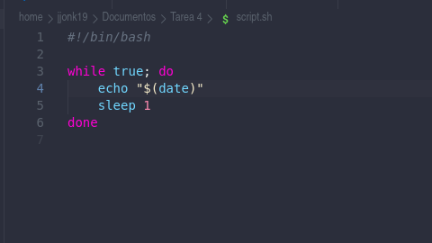
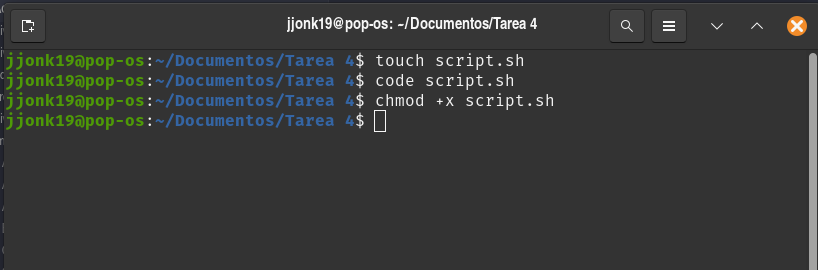
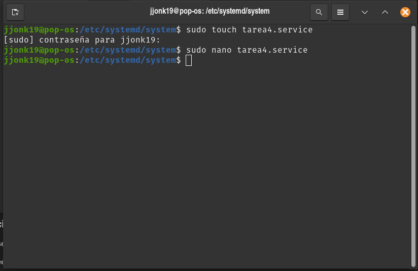
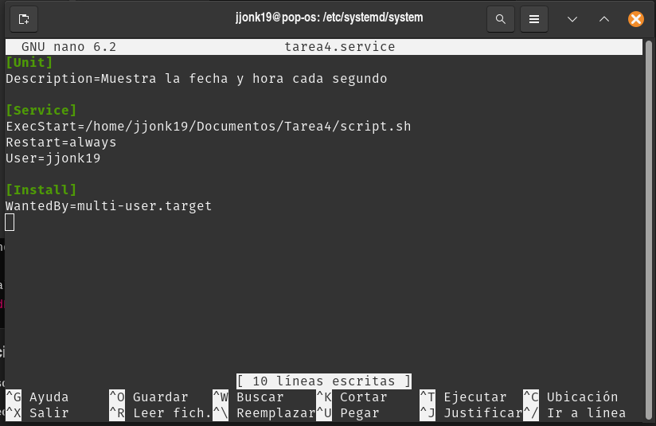

# Pasos

1. El primer paso es crear el script

2. Se le dan permisos de ejecución

3. Nos ubicamos en la ruta /etc/systemd/system y creamos nuestro archivo de servicio. El nombre puede ser cualquiera
mientras la extensión sea ".service".

4. Se tienen que recargar los daemons. El comando para ello es:

`sudo systemctl daemon-reload`

5. Para que nuestro servicio se inicie automáticamente cada que arranque el sistema, se debe utilizar el comando:

`sudo systemctl enable tarea4.service`

6. Para fines prácticos, el servicio se puede iniciar manualmente usando:

`sudo systemctl start tarea4.service`

De esta forma, podemos ver los resultados sin reiniciar el sistema.

7. El comando para ver los journal es:

`sudo journalctl -u tarea4.service`

Se puede agregar la flag --follow para que se vaya actualizando en tiempo real.